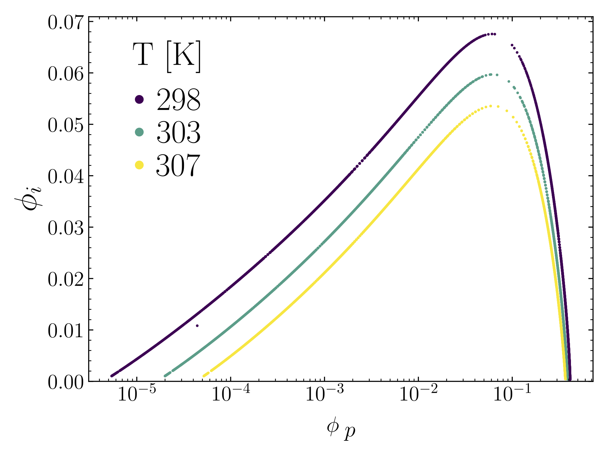

# Free energy minimization

The script in its current form is meant to reproduce Fig. 3 in [Adhikari, Leaf
& Muthukumar. *J Chem Phys* **149**, 163308 (2018)](https://doi.org/10.1063/1.5029268).

  

## f.py

Define your free energy expression, objective equation, and constraint equations in here.

## fe-min.py

Specify your constants, parameters, variables, solver options, and other
options here.

## Dependencies

- <tt>NumPy >=v2.1.3</tt>
- <tt>SciPy >=v1.14.1</tt>
- <tt>Matplotlib >=v3.9.2</tt>
